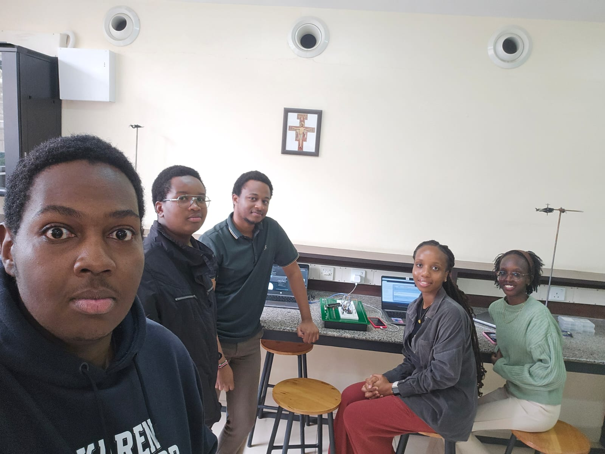
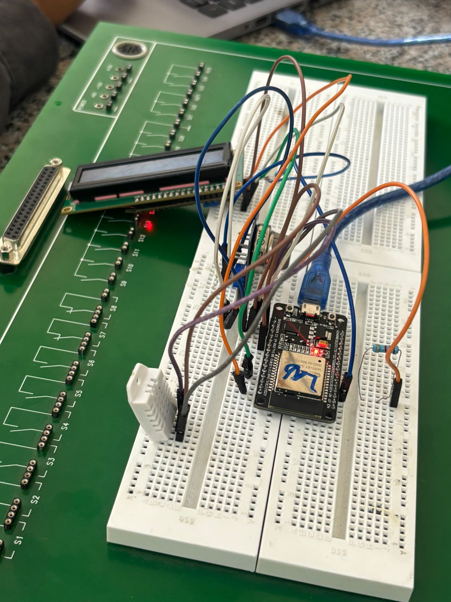
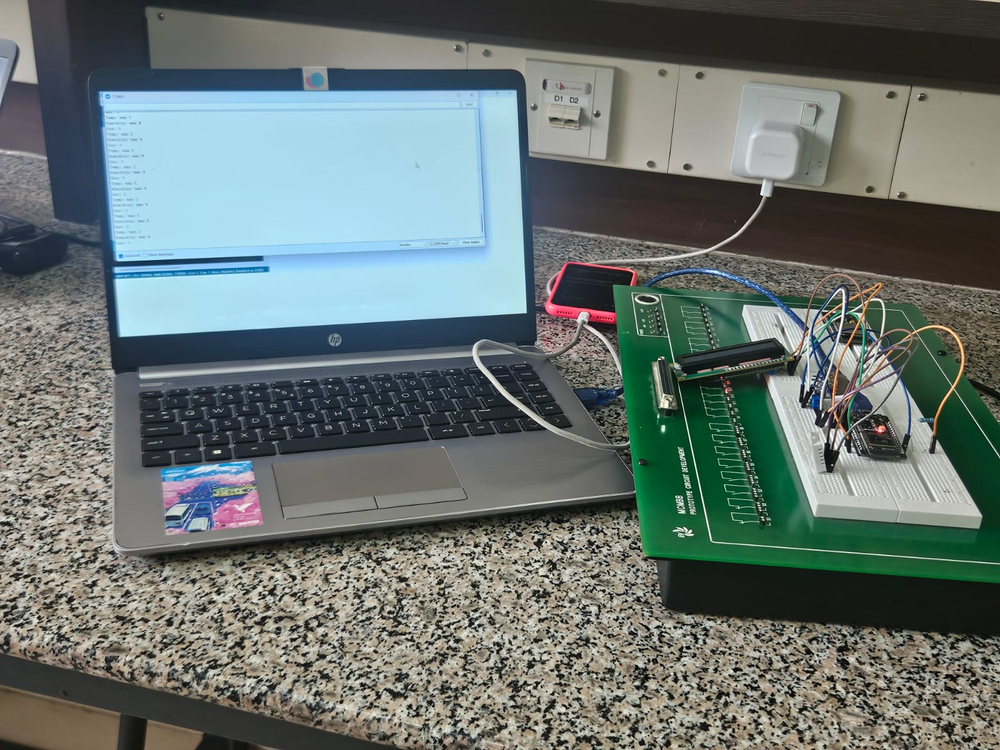
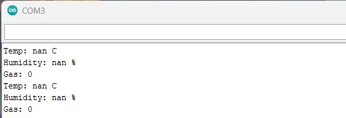
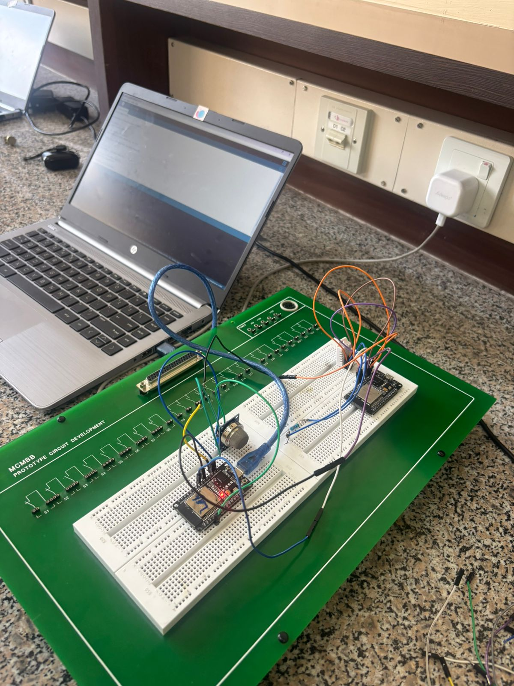
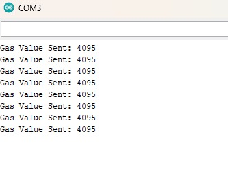
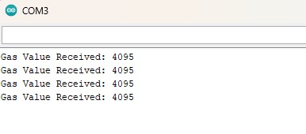
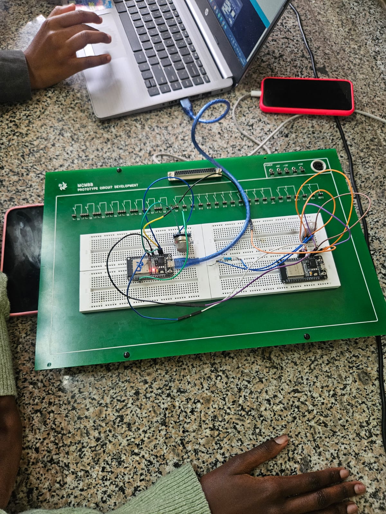

# Group Porsche – Deliverable 2.

Peter Nyamu-155390

Kimberly Wanjiru-159745

Joy Senetwo-157463

Joe Ndeto-169686

Jesse Mbugua-149540

---

# Prototype A:

## Physical Implementation:

---

## Simulated Prototype:

https://wokwi.com/projects/467615004126512129

### Problems Encountered and their Solutions:

The Wokwi gas sensor does not produce analog output by default in simulation. A sine-wave approximation was used in place of analogRead(MQ5PIN) to demonstrate realistic sensor behaviour. The hardware pin definition (GPIO 34) and read logic remain correct for physical deployment.

---

# Prototype B (Physical):

---

# Prototype C (Simulated):

## Simulated Prototype:

- Part a: https://wokwi.com/projects/467623656734761985
- Part b: https://wokwi.com/projects/467623919287754753

---

### Problems Encountered and their Solutions:

## Architecture (c) – Limitations and Solutions

### Simulation Limitation

The Wokwi free tier does not support running multiple independent firmware files within a single project. This limitation prevents the simulation of two ESP32 boards operating with separate programs while communicating through a direct physical relay connection. As a result, implementing the original architecture, where one ESP32 controls another through a relay signal, was not feasible within a single free-tier Wokwi simulation.

### Initial Approach

To overcome this limitation, the system was initially divided into two separate Wokwi projects:

- **Part a (Environment Node):** ESP32, DHT22 sensor and relay module responsible for monitoring environmental conditions and controlling the relay based on predefined thresholds.

- **Part b (Gas Safety Node):** ESP32 and MQ-5 gas sensor responsible for monitoring gas concentration levels.

However, because Wokwi does not support physical connections between components located in different projects, direct relay-based communication between the two ESP32 boards could not be achieved.

### Implemented Solution – MQTT over Wi-Fi

To enable communication between the two ESP32 nodes, MQTT messaging was adopted using the PubSubClient library. Both ESP32 boards were connected to the Wokwi virtual Wi-Fi network and communicated through the public HiveMQ MQTT broker.

The Gas Safety Node publishes gas sensor readings to an MQTT topic, while the Environment Node subscribes to the same topic and receives the gas data in real time. The Environment Node simultaneously monitors temperature readings from the DHT22 sensor and evaluates both temperature and gas concentration levels. Based on the received values, the relay is automatically activated or deactivated according to predefined safety thresholds.

This approach successfully simulates inter-device communication without requiring direct physical wiring between the ESP32 boards. Furthermore, it closely resembles real-world IoT deployments, where distributed sensor nodes exchange data through network protocols and cloud-based message brokers rather than dedicated hardware connections.
